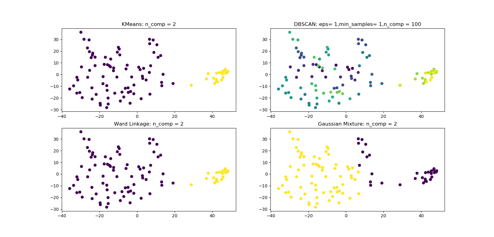
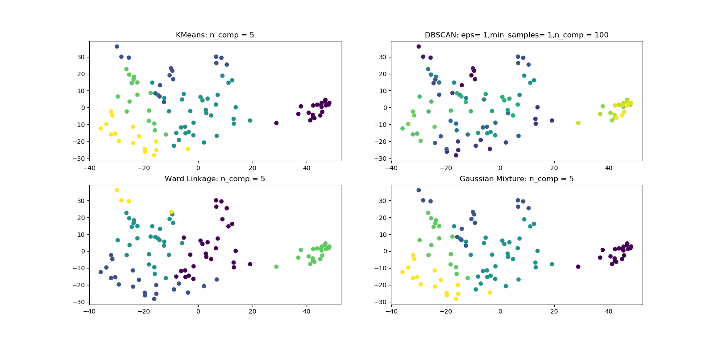
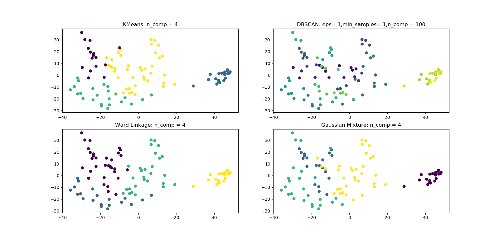
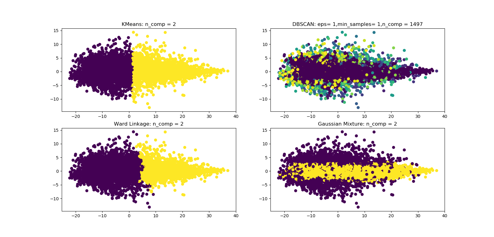
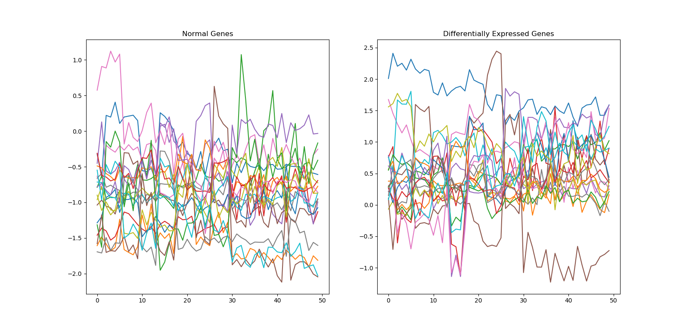

# Assignment-1: Do clustering for micro-array data

## Target

* Apply different cluster methods for micro-array Data, including clustering the samples/genes.
* Compare the result of different methods

## Data-Source & Instruments

### DataSource
* Database: [GEO](https://www.ncbi.nlm.nih.gov/geo/)
* Data: [GSE33532](https://www.ncbi.nlm.nih.gov/geo/query/acc.cgi?acc=GSE33532)
        (25906 probes, 100 samples)

### Requirements
* sklearn(python-package)
* matplotlib(python-package)
* Bioconductor(R-packages)

## Preprocessing

### Data Clean

The raw-data need 2 steps of preproccessing.

##### Prob to ID/Gene Name
The raw data of the chip is a matrix of [probes\*samples], but what we actually analyze is [genes\*samples].
So we need to transform the probe-ids to gene-names. I use 'Bioconductor' package to download the GPL file for finishing this.
Also, It's important to add tags for each samples considering our clustering targets.I have try 2 kinds of tags:
Use Tumor-stage tags & Histology tags.

#### Ignore unannotated data and Deduplication
After transformation, you may find some probes without annotation and we need to delete them.
Also,It's a feature of micro-array data that one gene might be detected by more than one probe. So we need to deduplication.
I use python to do this.

### Standardized and Decomposition
* Standard-Scaler
* Principal Component Analysis(PCA).[para: n_components=0.9]

## Algorithms

* [x] K-Means
* [x] DBSCAN
* [x] Hierarchical clustering
* [x] Gaussian Mixture

Meet problem that 'SpectralClustering' take about 99% of my RAM(12GB), also spending a long time to run but 
meets 'out of memory'. I just take 100 samples of the data and run them.

## Results

### 1.Clustering for samples: Dividing Normal/Tumor samples 

|   Cluster   |  K-Means  |  DBSCAN  |  Agglom  |  GMM  |
| ----------- |:---------:|:--------:|:--------:|:-----:|
|     ARI     |    1.0    |    0     |   1.0    | 0.554 |   

### 2.Clustering for samples: Dividing different tumor stages(Poor)

|   Cluster   |  K-Means  |  DBSCAN  |  Agglom  |  GMM  |
| ----------- |:---------:|:--------:|:--------:|:-----:|
|     ARI     |   0.306   |    0     |   0.276  | 0.306 |

### 3.Clustering for samples: Dividing different histology types

|   Cluster   |  K-Means  |  DBSCAN  |  Agglom  |  GMM  |
| ----------- |:---------:|:--------:|:--------:|:-----:|
|     ARI     |   0.482   |    0     |   0.510  | 0.392 |

### 4.Clustering for genes(poor)

Patterns of 2 clusters(insignificant):

