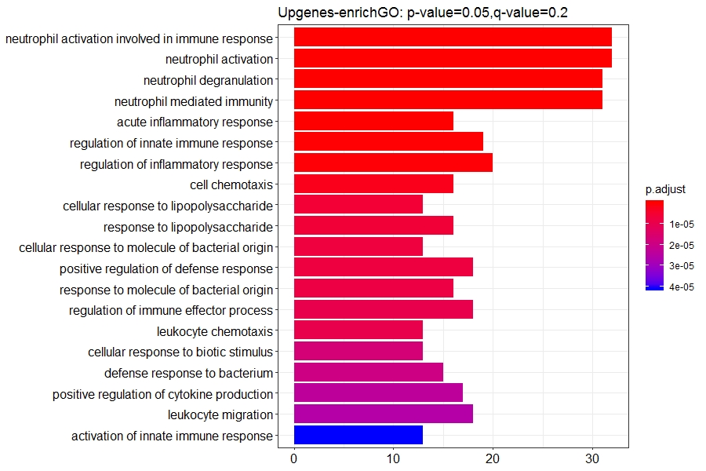
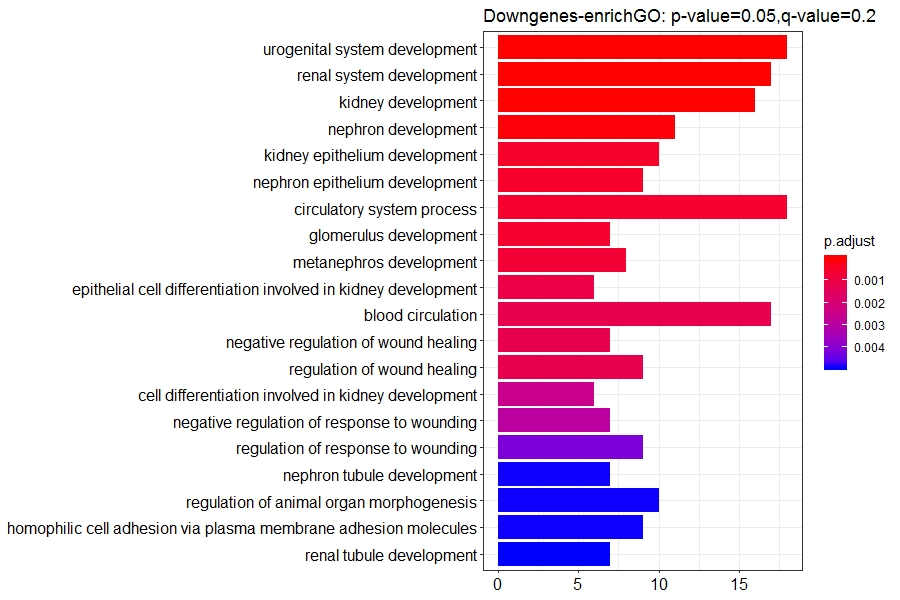
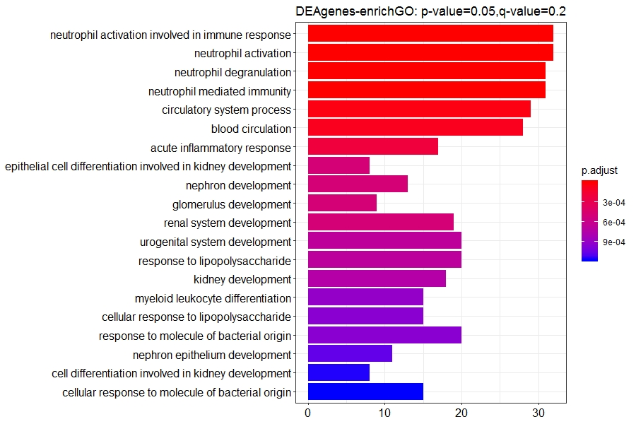
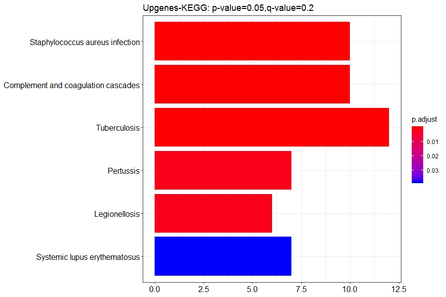
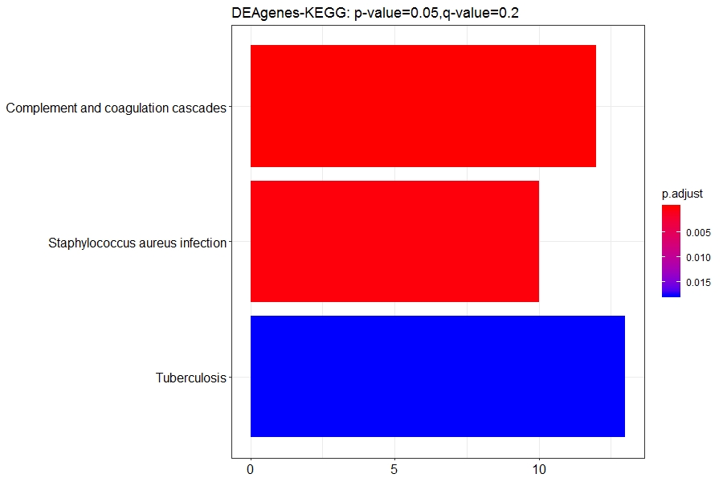

# Assignment3: Integrative analysis of single-cell ATAC-seq/DNA-seq data


## Target

* We would like to analysis the relation between the promoter-TSS regions and the DE-Genes, and the direct way is to unite two kinds of data through gene-names/gene-position.

## Preprocess: Unite different samples' BED files and do PEAK-ANNOTATION

* We need to use peaks data that are sample-repeatable. So we use [bedtools](https://bedtools.readthedocs.io/en/latest/index.html) for uniting BED file:
```
    bedtools intersect -wa -a SU444_merge.bed -b SU484_merge.bed SU496_merge.bed > merge.bed
```


* Use the BED file to do Peak-Annotation and Motif-Finding.(Tools:[HOMER](http://homer.ucsd.edu/homer/index.html))

## Workflow

* STEP1: We only need the TSS-region, so we should filt the peak-annotation file first:

```
    less merge_peaks.annotated | grep TSS > Promoter.annotated
```

* STEP2: Divide DEA-results into Up-express and Down-express genes lists:

```
    less Blast_vs_pHSC_DESeq2.csv | awk -F ',' '{if($3>0){print $1}}' > Up_genes.list
    less Blast_vs_pHSC_DESeq2.csv | awk -F ',' '{if($3<=0){print $1}}' > Down_genes.list
```

* STEP3: Unite ATAC-seq results and RNA-seq results. We will finally get 3 files(Up_dea_genes.csv/Down_dea_genes.csv/All_dea_genes.csv) and each of them are lists of gene-names that appear in DEA-results and Promoter.annotated. We use a python script(unite.py) to finish this.

* STEP4: Do GO/KEGG analysis using R-package [clusterProfiler](https://github.com/GuangchuangYu/clusterProfiler).We use threshold: p-value=0.05,q-value=0.2 for each analysis. And finally we successfully get all of the results except the KEGG for Down-express genes. The code we use is 'Enrich.r'.

## Result

* GO-results:







* KEGG-results:



