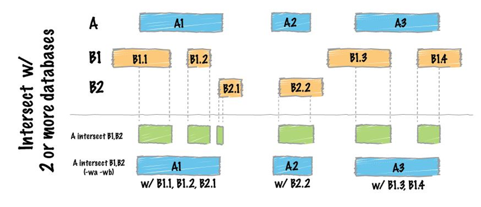

# Assignment3: Integrative analysis of single-cell ATAC-seq/DNA-seq data


## Get Differential Expression Genes Name

* We would like to analysis the relation between the promoter-TSS regions and the DE-Genes, and the direct way is to unite two kinds of data through gene-names/gene-position.

* So we needs to get the name-list of DE-genes first using the following command:

```
     cat Blast_vs_pHSC_DESeq2.csv | awk -F ',' '{print $1}' > diff_genes.list
```

## Unite different samples' BED files and do PEAK-ANNOTATION

* We need to use peaks data that are sample-repeatable. So we use [bedtools](https://bedtools.readthedocs.io/en/latest/index.html) for uniting BED file:
```
    bedtools intersect -wa -a SU444_merge.bed -b SU484_merge.bed SU496_merge.bed > merge.bed
```



* Use the BED file to do Peak-Annotation and Motif-Finding.(Tools:[HOMER](http://homer.ucsd.edu/homer/index.html))

## Unite the DE-gene Names and Peak-Annotation Information

* We only need the TSS-region, so we should filt the peak-annotation file first:

```
    less merge_peaks.annotated | grep TSS > Promoter.annotated
```

* Unite the two kinds of data:

```
    less diff_genes.list |while read gene; do less -S Promoter.annotated |grep $gene >> differential_gene_differential_accessibility.txt; done
```