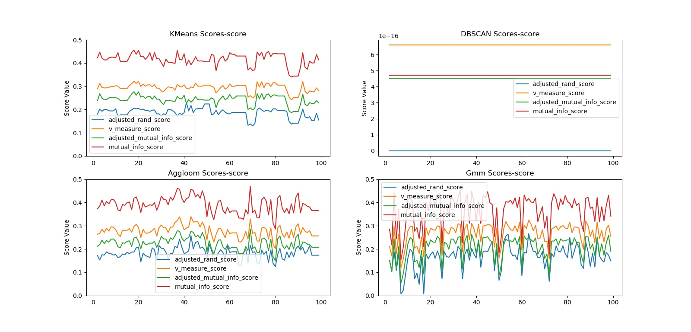
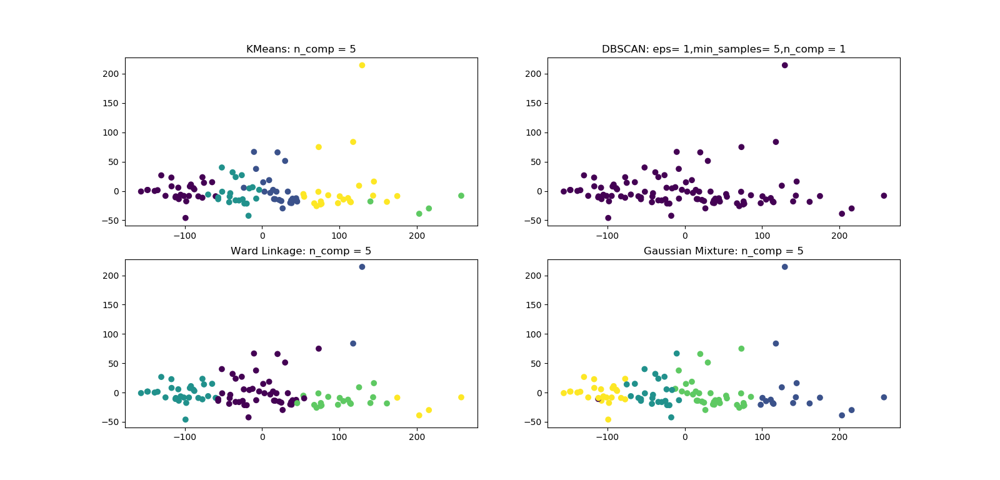

# Assignment-1: Do clustering for micro-array data

## 1.Target

* Apply different cluster methods for micro-array Data
* Compare the result of different methods

## 2.Data-Source

* Database: [GEO](https://www.ncbi.nlm.nih.gov/geo/)
* Data: [GSE33532](https://www.ncbi.nlm.nih.gov/geo/query/acc.cgi?acc=GSE33532)
        (25906 genes, 100 samples)

## 3.Preprocessing

* Standard-Scaler
* Principal Component Analysis(PCA).[para: n_components=0.9]

## 4.Algorithms

* [x] K-Means
* [x] DBSCAN
* [x] Hierarchical clustering
* [x] Gaussian Mixture
* [ ] Spectral clustering

Meet problem that 'SpectralClustering' take about 99% of my RAM(12GB), also spending a long time to run but 
meeting 'out of memory'. I just take 100 samples of the data and run them.

## 5.Results

Poor performance util 2019-05-04:

* Score Values v.s. feature-dimensions after PCA:

* Visualization

